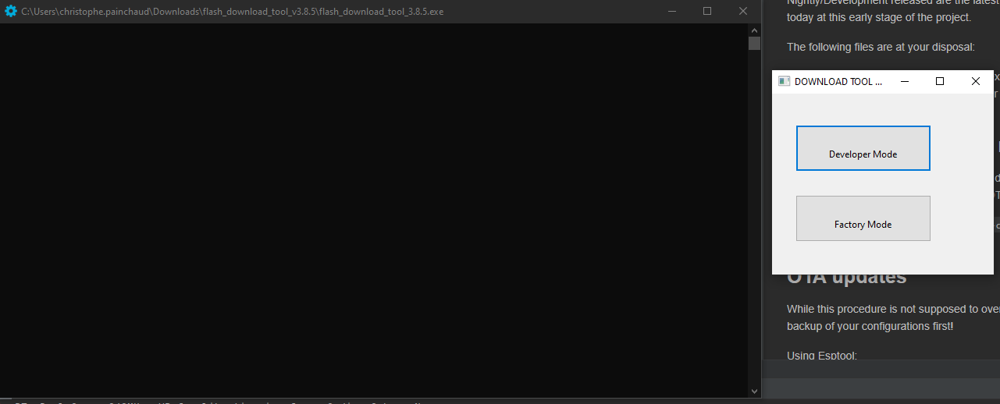
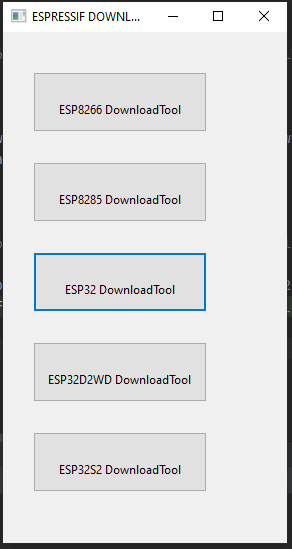
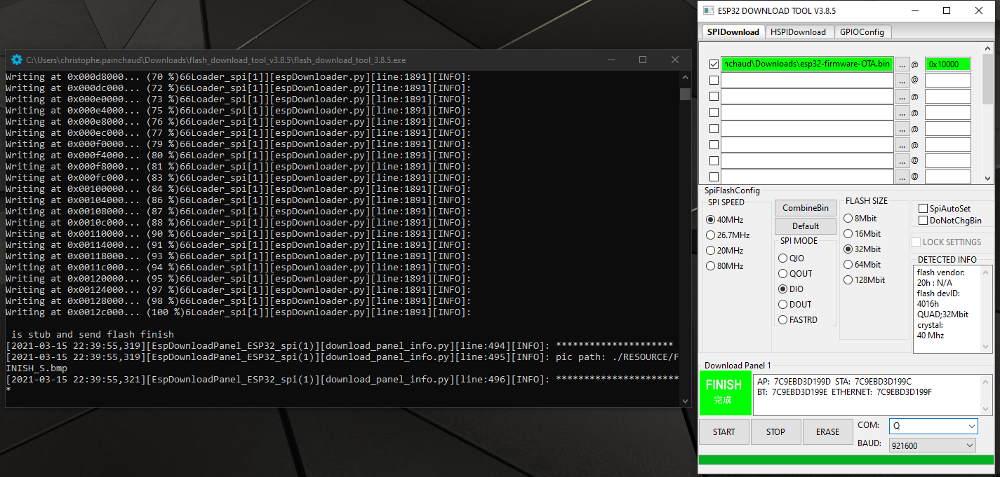

# RFLink-ESP Firmware Flashing Guide

## Downloading firmwares

Releases can be found [here](https://github.com/cpainchaud/RFLink32/releases)

Nightly/Development releases are the latest firmware compiled from the latest commits.
They are the only ones available today in this early stage of the project.

The following files are at your disposal:

- esp32-firmware-OTA.bin: to upgrade existing RFLink-ESP devices
- esp32-full.img: to flash a new device or erase a previous installation
- sonoff_bridge-firmware.img: firmware for the [Sonoff RF Bridge](doc/sonoff_rf_bridge.md)

## First time flash or full reset

If you have already installed RFLink on your device, beware the following will overwrite all your existing configuration.
Please have a look at the OTA Update if you just looking to upgrade an existing RFLink-ESP device!

### Using Esptool:

If you have not yet installed the 'esptool' module for python:

```shell
python -m pip install esptool
```

Erase flash entirely to ensure nothing will go wrong

```shell
python -m esptool --chip esp32 --baud 460800 erase_flash
```

Install the firmware

```shell
python -m esptool --chip esp32 --baud 460800 write_flash -z 0x1000 esp32-full.img
```

Subsequent updates should be done via the OTA mechanism.

## OTA updates

While this procedure is not supposed to overwrite your existing configuration, we strongly advise you to make a backup of your configuration first!

### Using WebUI

...TODO...

### Using RFLink serial commands

...TODO...

### Using Espressif's official tool

Download [Flash Download Tools](https://www.espressif.com/en/support/download/other-tools)  (ESP8266, ESP32, ESP32-S2)

If you want to flash firmware for a Sonoff RF Bridge then [follow this guide](doc/sonoff_rf_bridge.md).

At the first menu, select Developer Mode.



Then pick your model.



Select your firmware file and make sure you input `address=0x10000`, select your COM PORT and click start.


A progress bar will show up (you may have to keep pressing your BOOT button
until the process starts).



Reboot and enjoy!
