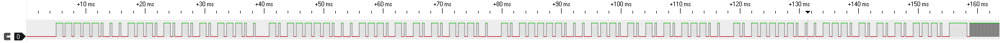

# How to write a plugin

You have a device that RFLink does not support, and you want to help developing a plugin for it? This guide is for you.

## Identifying the device characteristics

First, you must make sure which frequency is used by your device. Usually, this is indicated in the accompanying user manual, or on the device itself. For this guide, we will use the Silvercrest set of 4 radio-controlled power plugs.  
On the remote of this set, it is written 433.92MHz, which luckily is one of the most common frequency used by this kind of devices.

After having started our RFLink board, we place it in “debug” mode by issuing this order on the serial port:

    10;RFUDEBUG=ON;

With this, anytime a set of RF pulses arrives and is not recognized by a plugin, the board will output what it has seen, in this format:

    20;XX;DEBUG;Pulses=196;Pulses(uSec)=1152,352,1152,352,1152,384,1120,384,1120,384,352,1152,352,1184,320,1184,1120,416,1088,416,1088,416,320,1152,1120,416,320,1184,1088,416,320,1184,1088,416,320,1184,1088,416,1088,416,1088,416,320,1184,320,2336,1120,416,320,1184,1088,416,1088,416,1088,416,1088,448,1088,416,320,1216,320,1184,320,1184,1088,416,1088,416,1088,448,320,1184,1088,416,320,1216,1088,448,320,1216,1088,416,320,1184,1088,416,1088,448,1088,448,320,1184,320,2336,1088,416,320,1216,1088,416,1088,448,1056,448,1056,448,1088,448,288,1216,320,1184,320,1216,1088,448,1056,448,1088,448,288,1216,1056,448,320,1216,1088,448,288,1216,1088,448,288,1184,1088,448,1056,448,1056,448,288,1216,320,2368,1056,448,288,1216,1056,448,1056,448,1056,448,1056,448,1056,448,288,1216,288,1216,288,1216,1088,448,1056,448,1056,448,288,1216,1056,448,288,1216,1056,480,288,1216,1056,480,288,1248,1056,448,1056,480,1024,480,288,1248,2976,448

This tells us that the board as seen 196 pulses, and that the first was a `high` state that lasted 1152µs, followed by a `low` state that lasted 352µs and so on.  
It is often easier to represent those pulses as a time-based graph because it allows “seeing” the signal that gets received.  
For this, you can use the `pulses_to_csv.bat`” script available in the `tools` folder.  It starts `powershell` and runs the `pulses_to_csv.ps1` script with the appropriate permissions.  
This script will ask you for two parameters:

* `filename` --> the name of the CSV file which will be used
* `pulsesStr` --> the pulses as emitted by RFLink, that is the entire content right after the `Pulses(uSec)=` marker

The script then creates a CSV file that can be interpreted by PulseView, and if it is installed in the standard location, it even starts it for you.

In our case, this gives the following representation:

With this, it’s a bit more obvious that there is a repeating pattern: a `short` high pulse, followed by a `long` down pulse, followed by 48 medium or short pulses.

By pressing the same button multiple times, we notice that we always receive between 180 and 320 pulses, that the repeating pattern is always the same length and that the long, medium and short pulses durations do not vary much from one press to the other.  
We also notice that the 48 medium or short pulses always occur as one of four possible patterns.

Pressing another button on the remote, we notice that the pulses we receive still follow the same pattern, except that the 48 medium or short pulses give a different set of four possible patterns.

Last, what is obvious is that inside those 48 pulses, there are only two possible pairs:

* Medium followed by short
* Short followed by medium

This is the indication of a well know kind of encoding, called PWM where the duration of a pair is always the same, but the `high`/`low` ratio takes two values, hence define a single bit of information.

## Reception

Now that we a good enough knowledge of the protocol, we can write a plugin that will decode the received data.

First, we open the `Plugins/_Plugin_Config_01.h` file and look inside it to find a plugin number that makes sense with respect to the existing ones. In our case, we are dealing with a remote, so this will be placed in the first block. And the first available number is 16, so we add the following line:

    #define PLUGIN_016 // Silvercrest

This will make the project try to compile the `Plugins/Plugin_016.c file` which then add to the source tree.

The first thing to do is to give a description for our plugin:

    #define PLUGIN_DESC_016 "Silvercrest remote controlled power sockets"

We can also define a constant for our plugin number like so:

    #define SILVERCREST_PLUGIN_ID 016

And finally, we declare the function that will decode the pulses:

    boolean Plugin_016(byte function, const  char *string)
    {  
    }

Note that this function must be inside a `IFDEF PLUGIN_06` section to allow it not to be compiled if the user decides to exclude your plugin.

The parameters are required by the RFLink framework but can usually be ignored. Just know that when booting, the plugins are told to initialize themselves by calling their decode method with `string` set to `null`. In our case, we don’t have any initialization to perform, so we can ignore the parameters.

The first thing to do inside the method is to declare constants for the pulses that we are expecting to see, like so:

    const  int SLVCR_MinPulses = 180;
    const  int SLVCR_MaxPulses = 320;
    const  int SLVCR_StartPulseDuration = 2000 / RawSignal.Multiply;

As you can see, the pulse duration constants are divided by the `RawSignal.Multiply` value. This is because the user may have chosen to filter out too short signals by applying a division to the raw values as read from the receiver.  
Note that those divisions are made once at the start of the method, and because of this, they should not be moved outside the method. Indeed, the division would then be done at boot time, when `RawSignal.Multiply` has not been set yet and thus has a value of 0. And a division by 0 is a sure way to trigger a fatal exception, thus making the board enter a boot loop!

The basic idea when writing the decode method is to abord as soon as possible, to give back control to other plugins rapidly. The shorter the time to process a series of pulse, the less messages are missed. This is because the board is either listening or decoding.

So, as we’ve seen above, the signal has a somewhat variable total number of pulses, which means we start by writing this test:

    if (RawSignal.Number >= SLVCR_MinPulses && RawSignal.Number <= SLVCR_MaxPulses)

Then we look for the start of the bytes we are interested in and once we have found them, we call the ready-made method for decoding PWM pulses, from `7_Utils.h`: `decode_pwm`

Using the ready-made method ensures you are using a tested method and do not introduce subtle bugs in your version of the decoder. Early plugins did not follow this principle but rather copy/pasted the decoding which leads to a maintenance hell. They will eventually be fixed, so please stick the available decode methods.

As you can see, this method requires a few parameters, and in particular the duration of pulses, specified as a minimum and maximum duration. This is to allow slight variations in them, as they may occur because of interferences and receiving hardware differences.

Once we have the 3 decoded bytes, we can then process them. Once again, if we detect anything out of place, we return immediately, to save time on decoding.

And finally, we use the methods from `4_Display.h` to send the messages to the listening parties. Do not use `Serial.WriteLn` directly because the messages may need to be sent to MQTT or Ser2Net systems. Using the `display_XX` methods is the only way to make sure the decoded information is properly sent. And it also takes care of the message counter that appears as the second element on the output string.

The output is always started by a single `display_Header()` and finished by a single `display_Footer()` with as many `display_XX` calls as required for the protocol you have decoded

## Transmission

For transmission, you will also have to go into the `Plugins/_Plugin_Config_01.h` file and add a line for your plugin in the TX section. You must reuse the same number as the reception part, which gives this line to be added:

    #define PLUGIN_TX_016 // Silvercrest

Then, inside your `Plugin_016.c` file, you add a new function, surrounded by the appropriate `IFDEF` like so:

    #ifdef PLUGIN_TX_016
    // 10;Silvercrest;ID=RemoteId;SWITCH=ButtonId;CMD=State
    // 10;Silvercrest;ID=b;SWITCH=e;CMD=ON; // Button C
    // 10;Silvercrest;ID=b;SWITCH=7;CMD=OFF; // Button D
    // 10;Silvercrest;ID=b;SWITCH=7;CMD=ON; // Button D
    boolean PluginTX_016(byte function, const  char *string)
    {  
    }
    #endif  //PLUGIN_TX_016

It is recommended to add a few sample commands as comments above the definition of the method, this makes it easier to understand the available parameters.

As with the receiving function, the parameters can be safely ignored.

The first thing to do is to decode the command received by the board and for this you must use the `receive_XX ` methods from `4_Display.h`

This makes sure that all plugins use the same decoding logic and avoid copy/paste errors. As with the receiving part, older plugins are not respecting this, but they will be changed over time.

Once again, we also must give control back as soon as possible to spend as little time as possible interpreting a command that is not for us.  
In this plugin case, this is done like this:

    retrieve_Init();
    if (!retrieve_Name("10"))
        return  false;
    if (!retrieve_Name(PLUGIN_016_ID))
        return  false;
    if (!retrieve_ID(remoteId))
        return  false;
    if (!retrieve_Switch(buttonId))
        return  false;
    if (!retrieve_Command(buttonCommand))
        return  false;
    if (!retrieve_End())
        return  false;

As you will see by looking at those function source code, they allow for an optional `prefix` parameter to be specified on the control command. For instance, for the remote ID, you can either give `b` or `ID=b` in the command string. This is a convenient way to remember the usage of the given parameters. But please note that it does not allow to change the order of parameters at will, they are still expected in the order defined in the "prefix less" form.
If everything went well, we go on to prepare the bytes that we will send to the emitter and then manipulate the output pin for the appropriate duration:

    digitalWrite(Radio::pins::TX_DATA, HIGH);
    delayMicroseconds(PreambleHighTime);
    digitalWrite(Radio::pins::TX_DATA, LOW);
    delayMicroseconds(PreambleLowTime);

Note that this way of doing this is most likely to change in the future, it is quite error prone and not “interrupt” proof.  
Internal discussion is under way to find the best method.

### Storing values for the next transmission

Some protocols include a value that changes for every sent packet, following a given mathematical rule. Most often, it’s just an increase of the previous value, with a roll-over when it reaches a given maximum value. This is called a rolling code and can be seen in some remote-controlled garage doors as a way to avoid clashes with neighbor systems.

In that case, your transmitting plugin needs a way to store the value to be used for the next transmission. We thus recommend you use a file on the `LittleFS` file system provided by RFLink32.  
This way, it will survive an update of the firmware because it is stored in a different partition.

Here is an code showing how to store the value:  
  
    File file = LittleFS.open(ConfigFileName, "r+");  
    file.write((uint8_t*)&rollingCode, sizeof(rollingCode));  
    file.close();

And this can be retrieved later on with code like this:

    File file = LittleFS.open(ConfigFileName, "r");
    if (file.read((uint8_t*)&rollingCode, sizeof(rollingCode)) != sizeof(rollingCode))  
    {
        // notify error
    }
    file.close();

`ConfigFileName` is a constant value declared like this:

    const  char ConfigFileName[] = "/MyProtocol.bin";

where you replace `MyProtocol` by your protocol name. Note the leading forward slash, it **MUST** be included in the file name.

