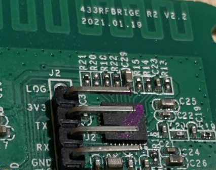
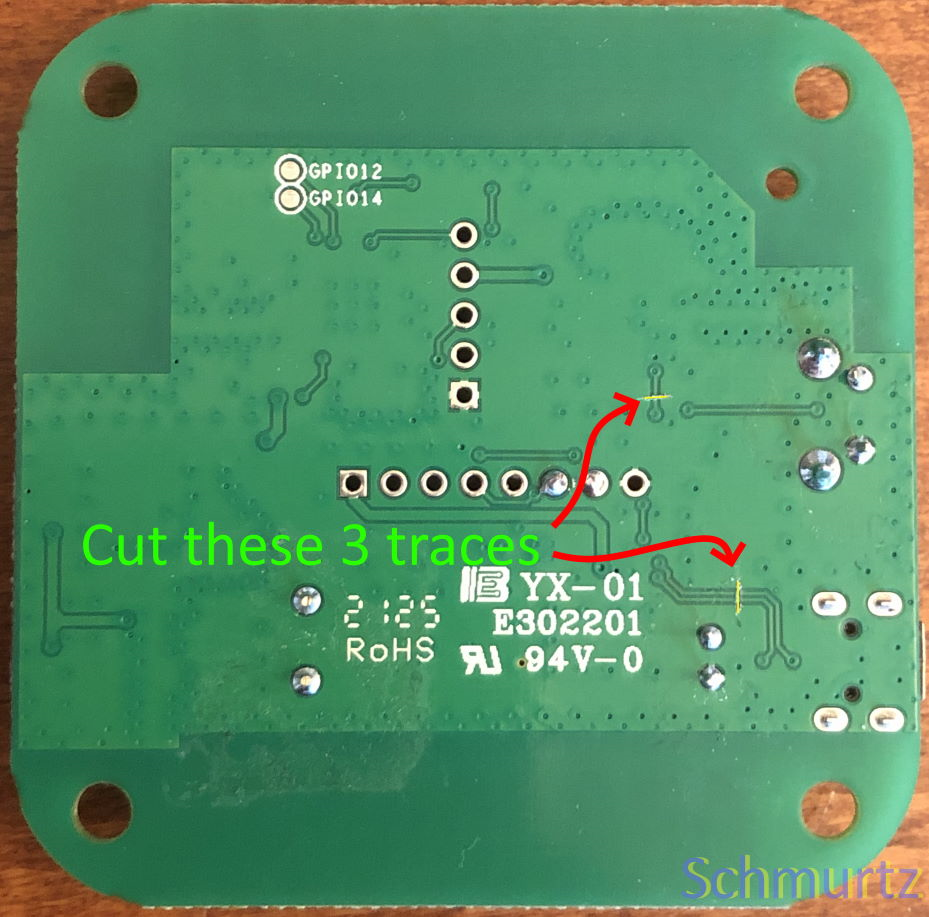
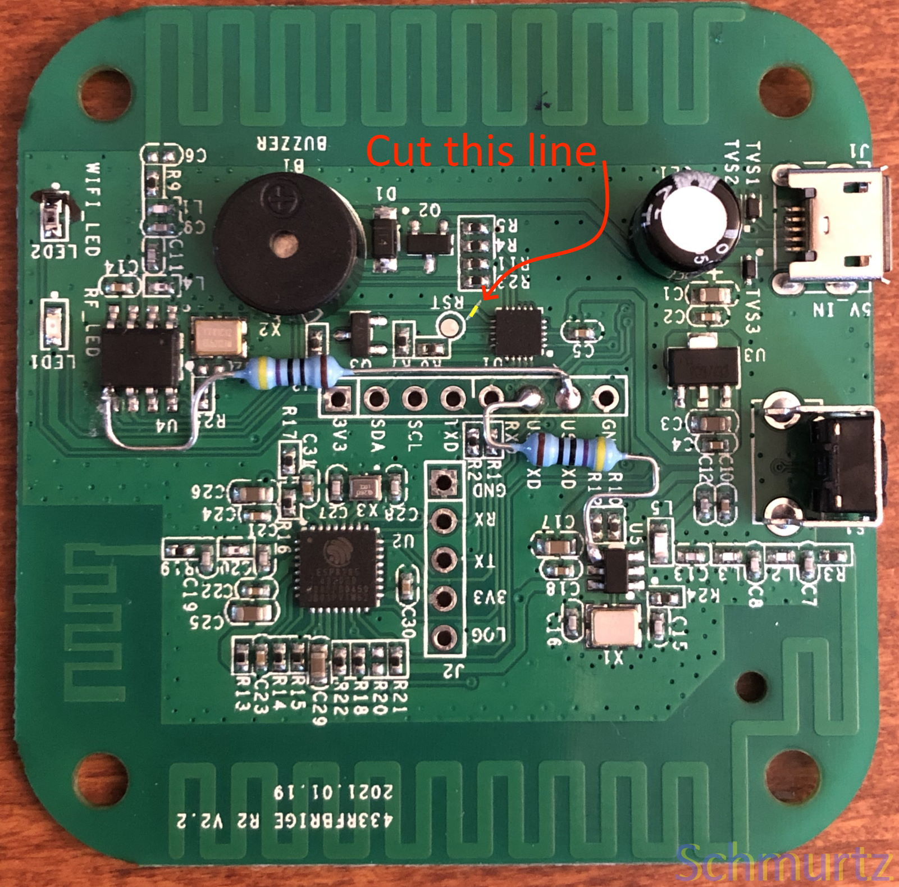

# Sonoff RF Bridge Instructions

This project supports the both versions of the Sonoff RF Bridge via the firmware file `sonoff_bridge-firmware.bin`.

## Flashing the firmware

### Soldering Header Pins

You must solder *header pins* onto the circuit board to access the UART/Serial interface.
The J2 holes conveniently have the pin names printed on the circuit board.
You can solder in right angle header pins so that you can place the circuit board back into the casing.
Only 4 header pins are required: the 3V3, RX, TX and GND.



It is easier to solder the header pins **after** you have done any hardware modifications.

> Having the header pins soldered in allows you to flash another firmware later on.
This device does not support OTA,  flashing via serial or the Config Portal.

### Connecting the Serial

To put the device into flashing mode, the pairing button must be held down whilst inserting the UART dongle into the USB on your computer. Finding a proper time to release the pairing button could be tricky. The button should be release after `esptool` is executed and just before `Connecting...` apears.

If your UART dongle cannot supply the required power then disconnect the 3.3v pin on UART (while keeping the RX, TX and GND pins connected) and then plug the device in via the built in USB port (marked as `J1` on the board) to power it via an appropriate USB power adapter that can provide 1 amp.

**DO NOT CONNECT BOTH THE `J2 3.3V` PIN AND `J1` AT THE SAME TIME AS YOU MAY DAMAGE YOUR BOARD.**

### Flashing via ESPTool

*After each step below, you will need to disconnect and reconnect your UART device (or if powering the board via `J1` - connect and disconnect this instead).*

If you have not yet installed the 'esptool' module for python:

```shell
python -m pip install esptool
```

Create a backup of the Sonoff firmware:

```shell
python esptool.py --baud 460800 read_flash 0x00000 0x100000 Backup_SonoffRFBridge.bin
```

Erase firmware:

```shell
python esptool.py --baud 460800 erase_flash
```

Flash the RFLink firmware:

```shell
python esptool.py --baud 460800 write_flash -fs 1MB -fm dout 0x0 sonoff_bridge-firmware.bin
```

You can then use either the [CLI](/CLI_Reference_Guide.md) connected via the UART to configure the RF bridge or the Config Portal.

To use the Config Portal, connect to the RFLink-AP access point and navigate to `http://192.168.4.1` in your web browser. Use `rflink32` for username and `433mhz` for password.

## Hardware Modification

To use this firmware a few hardware modifications must be carried on the gateway circuit board known as the *Direct Hack* to work correctly.

> The circuit board will have the revision and version printed on it, ensure you follow the correct instructions.

### R2 V2.2 Board

*Credit goes to [mateine](https://community.home-assistant.io/t/new-sonoff-rf-bridge-board-need-flashing-help/344326/17) from the HomeAssistant forum.*

This modification bypasses the signal decoder on the Sonoff board so that the ESP8285 is connected directly to the RF chip.
The soldering skill required is between low to medium difficulty.

Four circuit traces must be severed and two separate lines must be soldered together via resistors to complete the modification.
Any resistor in the range of 180Ω to 680Ω can be used.
You can sever the traces with a sharp blade or craft knife.

> Using the resistors will prevent any damage to the semiconductors in the case where a short circuit occurs.

#### Back Side



Like in the image above, cut the three traces.
The two traces grouped together connect the USB data with the GPIOs.
The trace above them connects the transcoder chip to the RF transceiver.

#### Front Side



Cut the trace and then solder the two resistors to their appropriate points on the circuit board.
Connect the `USBRXD` to pin 5 of the `U4` chip near the LEDs for the receiver.
Connect the `USBTXD` to pin 4 of the `U5` chip near the button for the transmitter.

It is recommended that you shape your to avoid surface mount components, like pictured above.
